# Image-Colourization
Recruitment project for 1st year

## Overview:

  Deep Learning is an upcoming subset of machine learning which makes use of artificial neural
  networks. These are inspired by the human brain and its immense structure and function. Here we
  make use of it to colorize black and white images.
  
  
  ## Methodology:
  
Taking input as a black and white image, this model tries to produce a colorized image. We are
using TensorFlow and Keras API. Our model is trained using Google Colab.

  1. To train the network, we start off with image datasets made up of colourful pictures. The
     datasets used here are CIFAR10 and Landscape Dataset. Then we convert all images from
     the RGB color space to the Lab color space. Just like RGB color space, Lab is an alternate
     color space in which the three
     channels represent:-
     - The L channel represents light intensity only.
     -  The a channel encodes green-red color.
     - The b channel encodes blue-yellow color.

 2. Since the L channel can encode intensity, we use it as the input in our network in the grayscale format. We put all ‘L’ values in an array called ‘X’.
 3. We then use our model to let the network predict the respective a and b channel values. The ‘ab’ values are divided by 128 (feature scaling) so as to reduce values from [-127, 128] to  (-1, 1] to make the learning process quicker and more efficient. These are now put in an array called ’Y’. 
 4. Our model is a Convolutional Neural Network (CNN) which trains on ‘X’ as feature inputs and ‘Y’ as target values.The model consists of a number of convolutional layers. There are no pooling layers in our network. Changes in resolution are achieved using striding and upsampling layers. The kernels are sized 3x3. 
 5. It uses the ADAM optimizer with a learning rate of 0.0003. The loss function used is mean squared error. It also includes a Dropout layer to prevent overfitting. 
 6. 10% of the dataset is used as the validation set. Our network trains for multiple epochs.
 
## Various Models:

### 1. Dog:
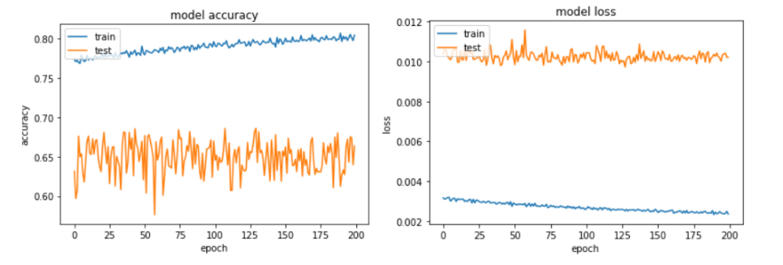
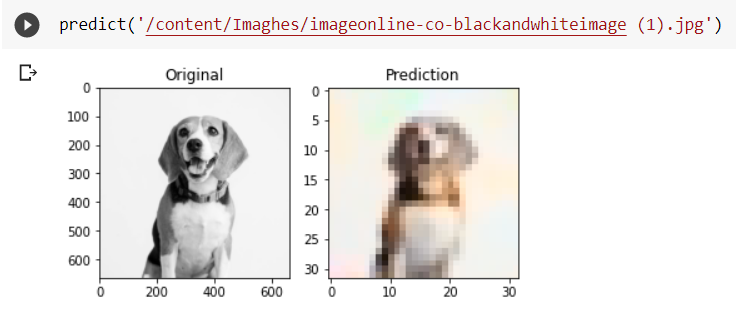

### 2. Flower:
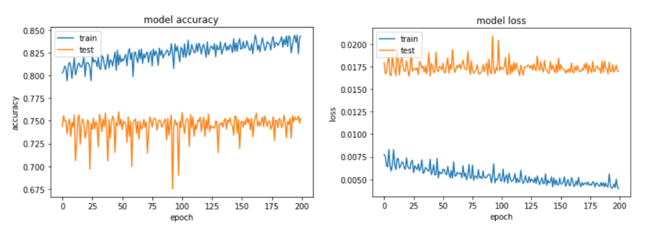
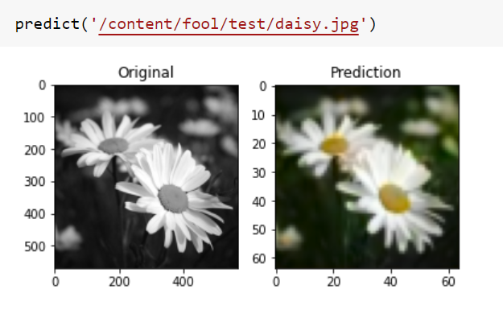

### 3. Landscape:
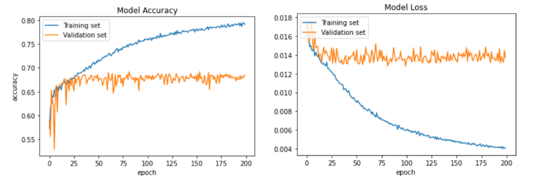
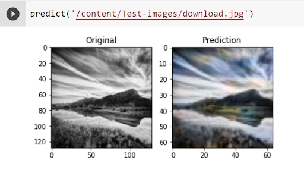

### 4. Landscape 2.0:
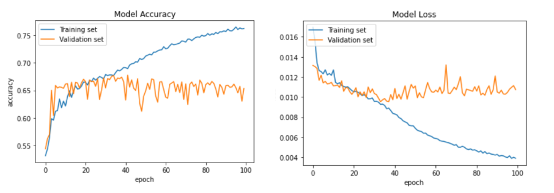
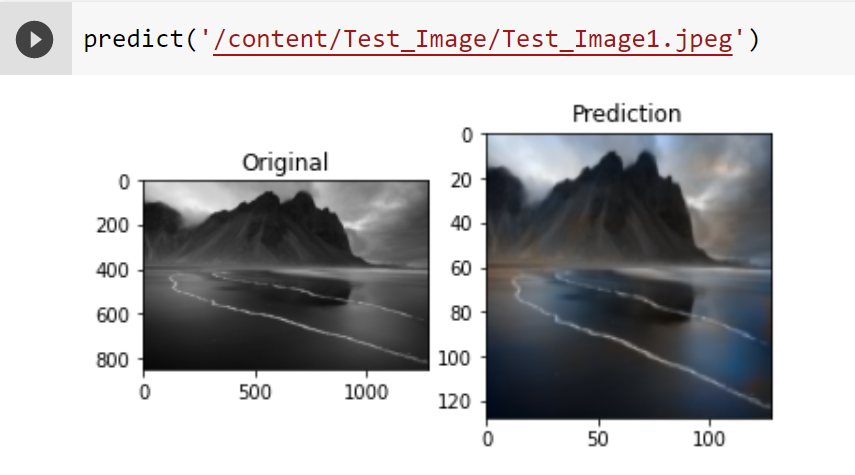
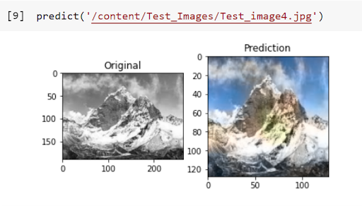
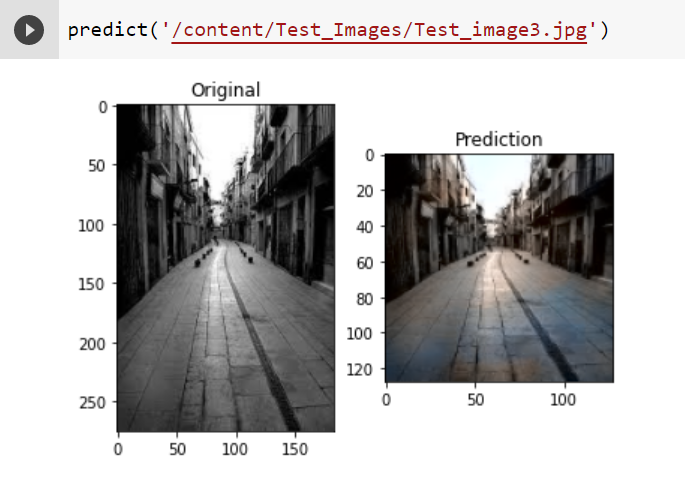
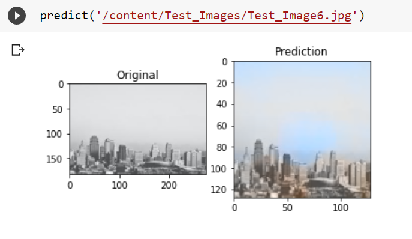

### 5. Flower 2.0:
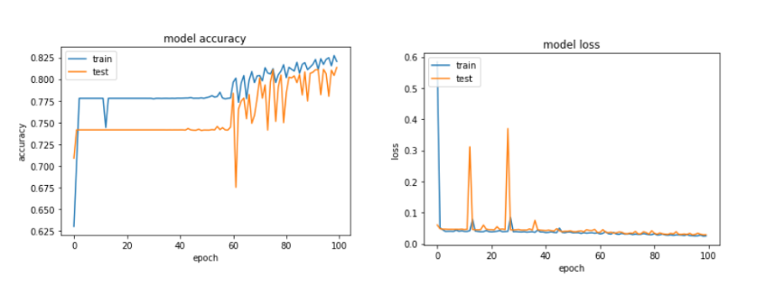
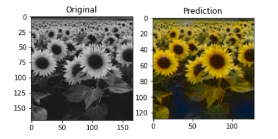
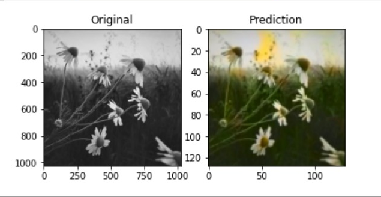
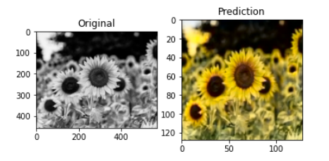
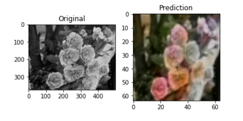

### 6. Multiclass:
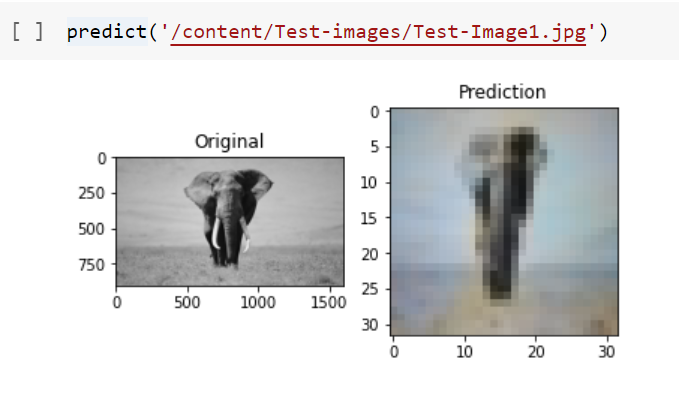
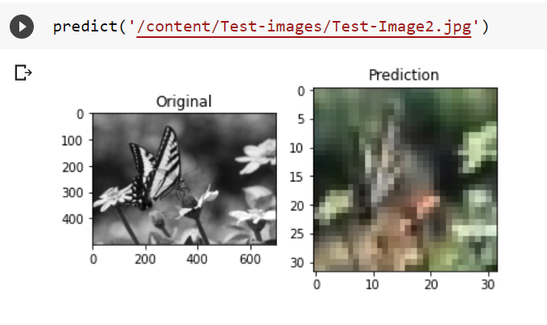
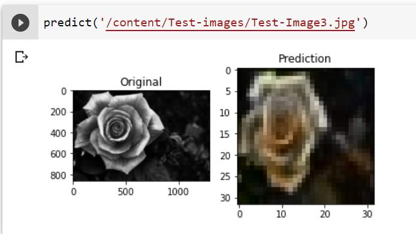

